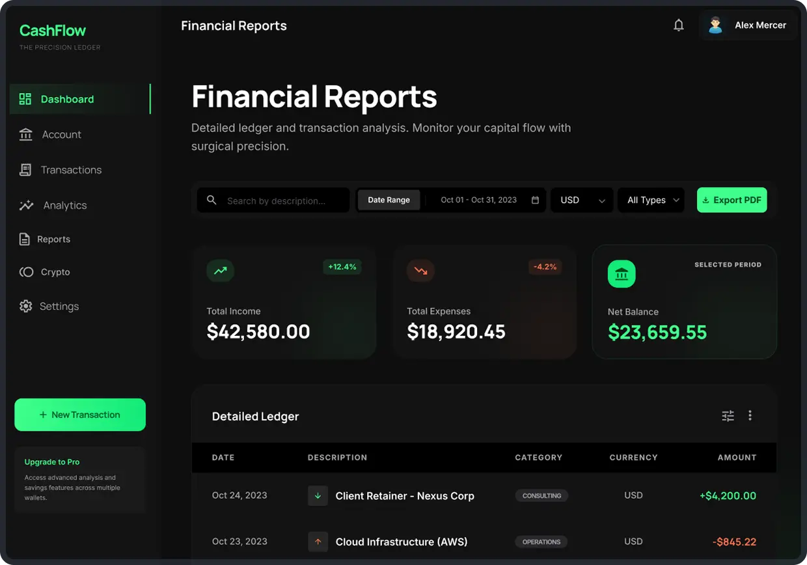

# 💸 CashFlow | The Precision Ledger

<p align="center">
  
</p>

> **Minimalist, elegant, and surgical precision for your personal finances.**

CashFlow is a modern financial management web application designed for those who seek total control over their wealth without the complexity of traditional banking apps. It acts as a **high-end digital ledger**—think of it as a spreadsheet with a "Pro" interface and automated insights.

---

## ✨ Key Features

### 🏦 Multi-Wallet System
Manage different financial pockets in one place. Configure each wallet with its own currency and purpose:
* **Savings:** Track your long-term goals.
* **Daily Expenses:** Groceries, services, and subscriptions.
* **Crypto Holdings:** (Coming Soon) Monitor your digital assets and entry prices.

### 🏆 Savings Reputation (A++)
Don't just track—improve. CashFlow features a **unique reputation system** based on your spending habits. 
* Establish monthly limits.
* Maintain discipline to increase your score.
* Visual progress bars that reflect your "Financial Pulse."

### 📊 Surgical Analytics
Get a clear view of your wealth evolution with high-fidelity charts:
* **Wealth Evolution:** Temporal distribution of assets across accounts.
* **Asset Distribution:** Visual breakdown (High-Yield, Index Funds, Crypto).
* **Detailed Ledger:** A real-time, searchable history of every movement.

### 🎨 Premium UI/UX
* **Dark Mode by Default:** Designed for focus and elegance.
* **Bento Grid Layout:** Organized information architecture.
* **Responsive Design:** Precise oversight on any device.

---

## 🚀 Tech Stack

| Tool | Usage |
| :--- | :--- |
| **Next.js** | Modern web framework for speed. |
| **Tailwind CSS** | Utility-first styling for the minimalist aesthetic. |
| **Lucide Icons** | Clean and consistent iconography. |
| **Chart.js / Recharts** | High-performance data visualization. |

---

## 🛠️ Installation & Setup

1. **Clone the repository:**
   ```bash
   git clone https://github.com/0xRefDev/cashflow_manager.git
   ```
2. **Navigate to the project directory:**
   ```bash
   cd cashflow_manager
   ```
3. **Install dependencies:**
   ```bash
   pnpm/npm install
   ```
4. **Run the development server:**
   ```bash
   pnpm/npm run dev
   ```
5. **Open the application:**
   ```bash
   http://localhost:3000
   ```